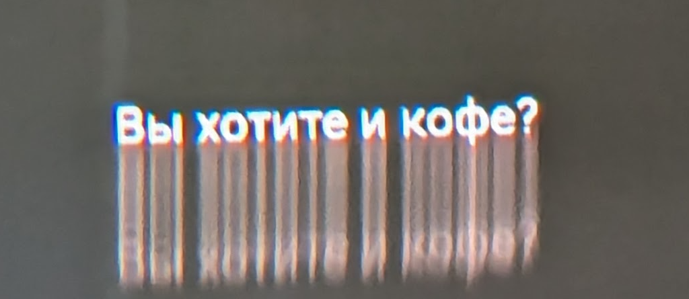
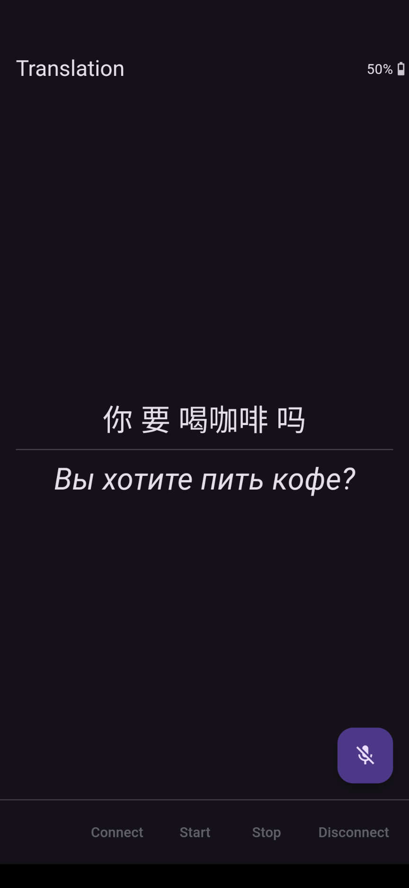

# frame_vosk_mlkit_nonlatin (live offline translation, subtitles, non-latin script)

Connects to Frame, streams audio from the Host (phone) microphone, which is sent through a local (on Host device) [Vosk speech-to-text engine (**Flutter package is Android only**)](https://pub.dev/packages/vosk_flutter), translates the text into a target language on-device using [ML Kit (Android, iOS only)](https://pub.dev/packages/google_mlkit_translation), and displays the translated text on the Frame display.

Drop in an alternative [Vosk model](https://alphacephei.com/vosk/models) to perform speech-to-text in a language other than Chinese (`vosk-model-small-cn-0.22` included). The model name appears in `main.dart` and `pubspec.yaml`.

Specify an alternative `targetLanguage` in [lib/main.dart](lib/main.dart) to translate to an [ML Kit supported language](https://developers.google.com/ml-kit/language/translation/translation-language-support) other than Russian.

This app uses TextSpriteBlock to send text as images to Frame, so non-Latin script is supported.

### Frameshots, Screenshots

### Architecture

### See Also
- [Frame Flutter Translate Host (plain Latin text only)](https://github.com/CitizenOneX/frame_flutter_translate_host)
